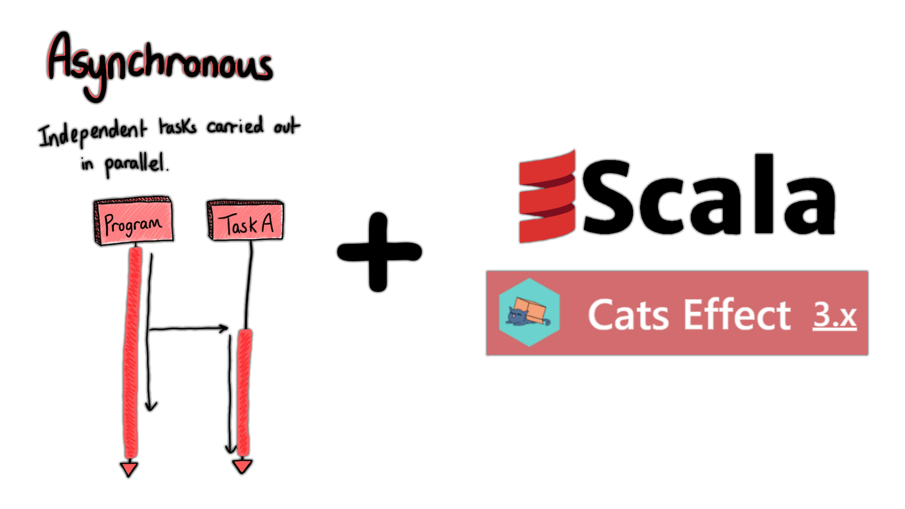

# CatsEffectByExamples - Asynchronous runtime in functional programming style 😼

👾📚 The objective is to do an easy-to-access codes snippets collections of important Cats Effect concepts.
Cats Effect possesses [IO](https://typelevel.org/cats-effect/api/3.x/cats/effect/IO.html)
for wrapping & chaining asynchronous codes executions.
It has also the concept of [Resource](https://typelevel.org/cats-effect/api/3.x/cats/effect/kernel/Resource.html)
for an automatic resources releasing after usage.
[Semaphore](https://typelevel.org/cats-effect/api/3.x/cats/effect/std/Semaphore.html) and more well known asynchronous
programming patterns are also part of the library.

# Table of contents 📃

🔎📚 For a better understanding of each subject please take the time to run the code snippets.
They all compile & are runnable ✅. So do not hesitate to fork this git repository 😊.

<ins>Remark</ins>: Some code snippets have multiple possible runs.

| 🔎 Subject       | 📃 Description                                                                                                       | 👾 Code snippets                                                         |
|------------------|----------------------------------------------------------------------------------------------------------------------|--------------------------------------------------------------------------|
| **IOs**          | *This part focuses on understanding `IOs` as data structures holding a manageable execution result.*                 | [Introduction](src/main/scala/_0_io/_A_Introduction.scala)               |
|                  |                                                                                                                      | [Parallel](src/main/scala/_0_io/_B_Parallel.scala)                       |
|                  |                                                                                                                      | [Traversal](src/main/scala/_0_io/_C_Traversal.scala)                     |
|                  |                                                                                                                      | [Exception](src/main/scala/_0_io/_D_Exception.scala)                     |
| **Concurrency**  | *This part focuses on understanding `Fibers` as threads starting & joining concurrently execution results in `IOs`.* | [Fiber](src/main/scala/_1_concurrency/_A_Fiber.scala)                    |
|                  |                                                                                                                      | [Uncancelable](src/main/scala/_1_concurrency/_B_Uncancelable.scala)      |
|                  |                                                                                                                      | [Race](src/main/scala/_1_concurrency/_C_Race.scala)                      |
|                  |                                                                                                                      | [Resource](src/main/scala/_1_concurrency/_D_Resource.scala)              |
| **Coordination** | *This part focuses on understanding well-known communication patterns between `Fibers`.*                             | [Ref](src/main/scala/_2_coordination/_A_Ref.scala)                       |
|                  |                                                                                                                      | [Deferred](src/main/scala/_2_coordination/_B_Deferred.scala)             |
|                  |                                                                                                                      | [Semaphore](src/main/scala/_2_coordination/_C_Semaphore.scala)           |
|                  |                                                                                                                      | [CountDownLatch](src/main/scala/_2_coordination/_D_CountDownLatch.scala) |
|                  |                                                                                                                      | [CyclicBarrier](src/main/scala/_2_coordination/_E_CyclicBarrier.scala)   |

# Main references 📚

- [Official docs](https://typelevel.org/cats-effect/docs/getting-started)
- [ScalaDoc](https://typelevel.org/cats-effect/api/3.x/index.html)
- [RockTheJVM course](https://rockthejvm.com/p/cats-effect)